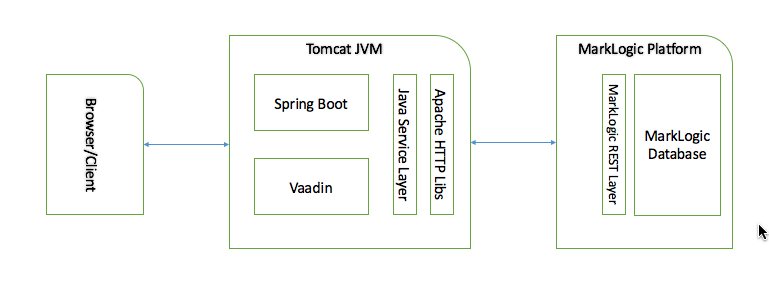

# Full stack Vaadin, Spring Boot and MarkLogic demo application.


This application expect MarkLogic application sever REST instance running on port 8000. You can change the application server port in ml-server-config.properties file.


## High Level Architecture Diagram


## Following REST end-points are covered.

| REST end-point  | Operation     |
| --------------  | ------------- | 
| Documents  	  | [PUT] (https://docs.marklogic.com/REST/PUT/v1/documents)	 	  | 
| Documents		  | [DELETE] (https://docs.marklogic.com/REST/DELETE/v1/documents)
| Search  	 	  | [GET] (https://docs.marklogic.com/REST/GET/v1/search)	          |
| Config Query	  | [POST] (https://docs.marklogic.com/REST/POST/v1/config/query/['default'-or-name])	 	  |


## Running

You can run the project with 

```
mvn package spring-boot:run
```
