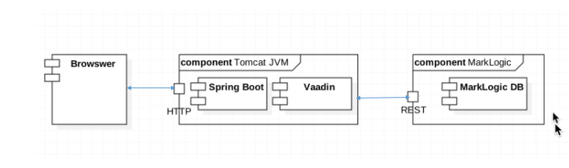

# Full stack Vaadin, Spring Boot and MarkLogic demo application.


This application expect MarkLogic application sever REST instance running on port 8000. You can change the application server port in ml-server-config.properties file.




## Running

You can run the project with 

```
mvn package spring-boot:run
```